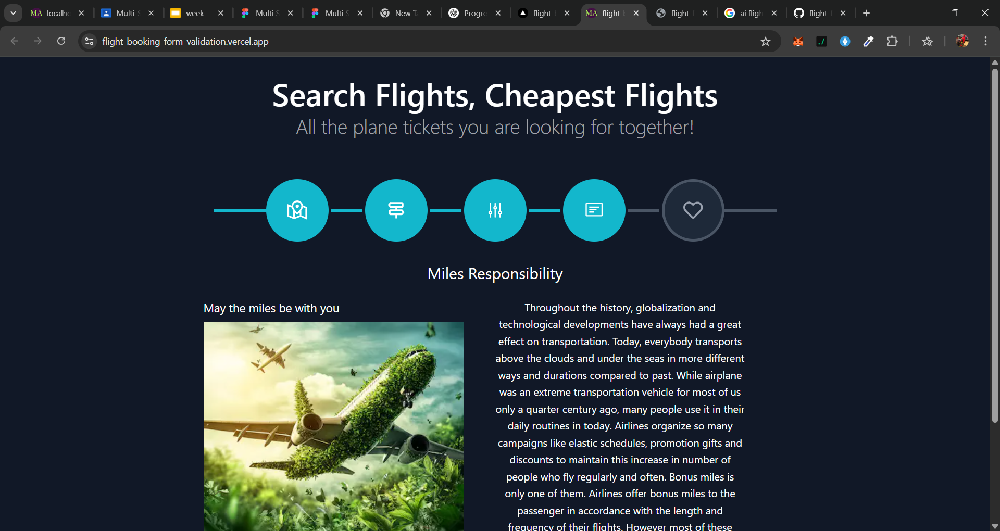

#  Flight Booking Multi-Step Form

A responsive, modern multi-step flight booking form built with **React**, **Next.js**, **TypeScript**, **Tailwind CSS**, and **React Hook Form**. 
The form allows users to search flights, select preferences, view ticket information, and proceed through multiple steps with a visual progress indicator — closely styled to a Figma prototype.

---

## 📸 Preview

> 

---

## 🚀 Features

- 🔵 **Multi-step form navigation**
- 🎛️ **Progress indicator with icons and connecting lines**
- ✅ **Form validation with React Hook Form**
- 📄 **Dynamic ticket information table**
- 🌗 **Fully responsive design with Tailwind CSS**
- 🖼️ **Styled closely based on a Figma design prototype**
- 📱 **Mobile-friendly horizontal scrolling table**
- ✨ Clean, modern UI and UX

---

## 🛠️ Technologies Used

- [Next.js](https://nextjs.org/)
- [React](https://reactjs.org/)
- [TypeScript](https://www.typescriptlang.org/)
- [Tailwind CSS](https://tailwindcss.com/)
- [React Hook Form](https://react-hook-form.com/)
- [React Icons](https://react-icons.github.io/react-icons/)
- [Figma](https://www.figma.com/) (for design reference)

---

## 📦 Installation

1. **Clone the repository**
   ```bash
   git clone https://github.com/Atilola-code/flight_form_validation.git
   cd flight-booking-multistep-form
